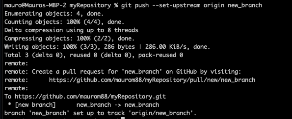
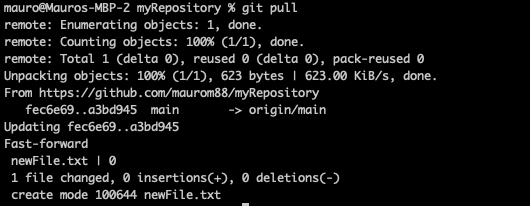

# Git and GitHub practice
This repository contains a series of steps that will teach you a simple workflow for using Git and GitHub.

## Index
1. [Section 1: Create and clone a repository](#section-1-create-and-clone-a-repository)
1. [Section 2: Apply changes locally](#section-2-apply-changes-locally)
1. [Section 3: Push updated repository to GitHub, merge to main/master](#section-3-push-updated-repository-to-github-merge-to-mainmaster)
1. [Section 4: Update your local main/master and keep working](#section-4-update-your-local-mainmaster-and-keep-working)

## Section 1: Create and clone a repository

In this section you will:
1. Create a new remote repository on GitHub
1. Clone the new repository on your computer

Go to https://www.github.com and create a new repository

Enter the required information about your repository.
The only mandatory field is "name", but make sure to check "Add a README file", which will make your life easier later.

In the repository you have just created, click the green button "Code" and copy the https url

On your computer, open a command prompt and navigate to the folder where you want to save your local repository (using the `cd` command).
Use `git clone` followed by the url you copied before, to clone the remote repository on your computer.

At this point, you will have a folder with the same name as your repository.
Use `cd <folder_name>` to get inside your folder. For example: `cd myRepository`.

## Section 2: Apply changes locally

In this section you will:
1. Create a new branch
1. Make some changes
1. Commit the changes you made

Whenever you need to make some changes on a repository, starting from Main/Master, you need to create a new branch (or move to a branch you are already using for making changes) with the command: `git branch <new_branch_name>`.
Then, switch to the new branch you have just created `git checkout <branch_name>`.

Make some changes (for example, I have created a text file called "newFile" in my folder).

Now, you have to tell git that you want these changes to be saved, and you do so with two commands:
1. `git add <file_name>`
1. `git commit -m "Some message"`

In this case, I could have used `git add newFile.txt` but, for the sake of simplicity, I used `git add .` which means that I want to add all my changed files.

## Section 3: Push updated repository to GitHub, merge to main/master

In this section you will:
1. Use `git push` to update a remote repository
1.

Now that everything is updated locally, we can use `git push` to update the repository on GitHub

The only problem is that, even though Git knows which repository to push the contents to (because we cloned it), it doesn't know where to put this specific branch, because it has only been created locally.
Following exactly the instructions in the output message, will solve this issue: `git push --set-upstream origin <branch_name>`

Once `push` has completed uploading the new branch with all its files, let's go back to https://www.github.com and open the repository. A message will say that there is a new branch with recent changes. Click the green button "Compare & pull request"

In the following steps, just clicking the green buttons in sequence will allow you to merge the contents from the new branch to main/master.

At the end, you can decide to delete the new branch, but this will only remove it from GitHub! The local branch, on your computer, will remain intact.

## Section 4: Update your local main/master and keep working

Now, we only need to update our local repository. In you command prompt, first switch back to the main repository.

Pull the most recent changes.
This is particularly important when working with other people! If someone else makes changes and merge a branch to main, using `pull` is the only way to have the most updated files on your computer and not risk messing up somebody else's work.

### Final comments and remarks
If you need to apply more changes, go back to Section 2: Apply changes locally and repeat the procedure until the end
